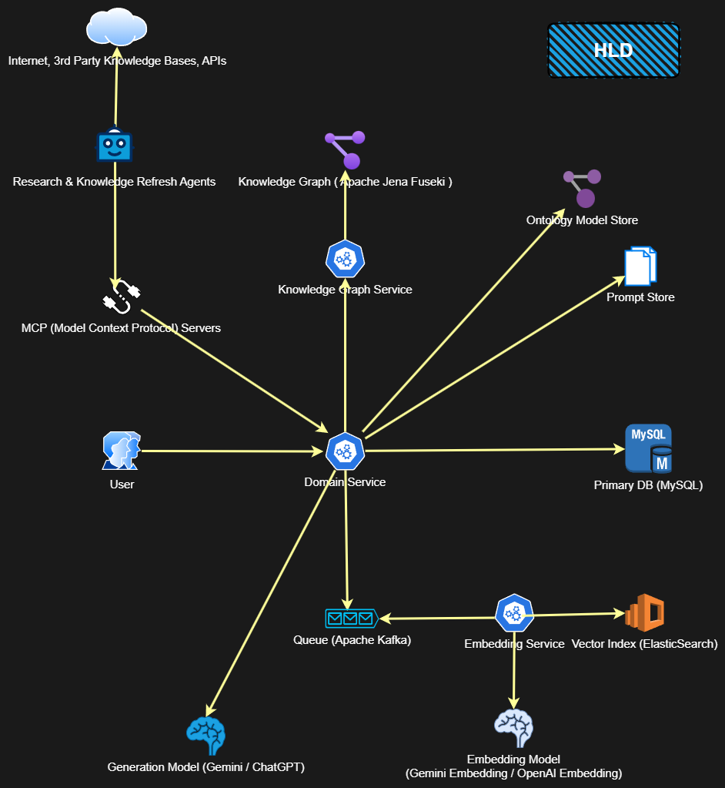
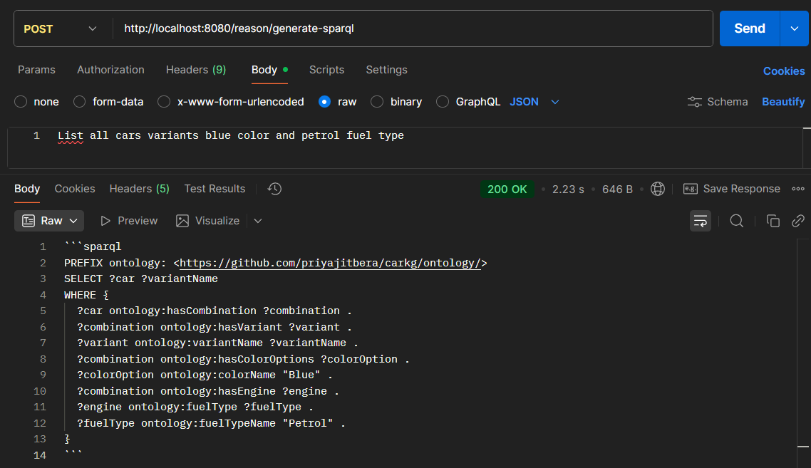
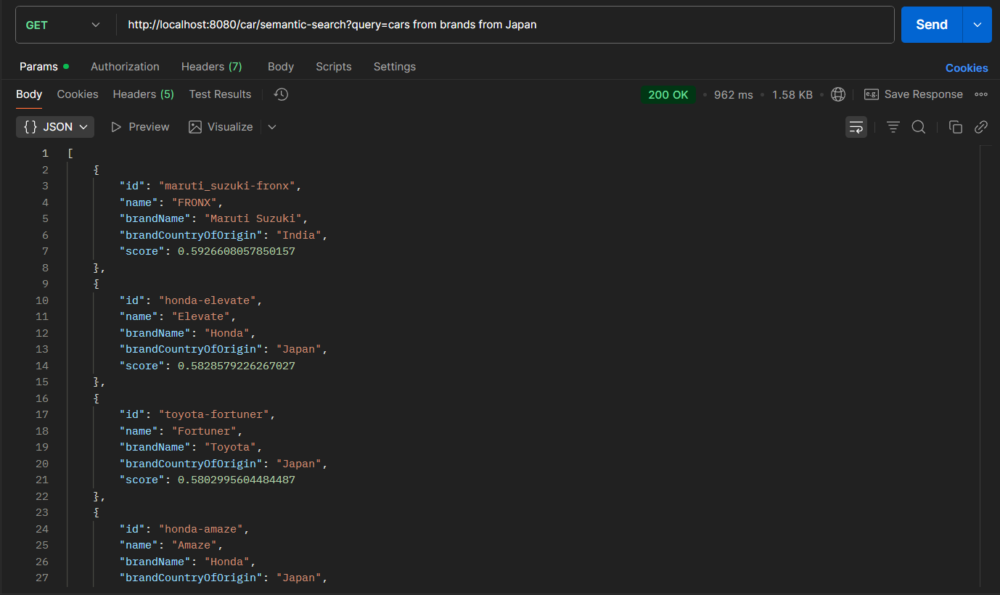
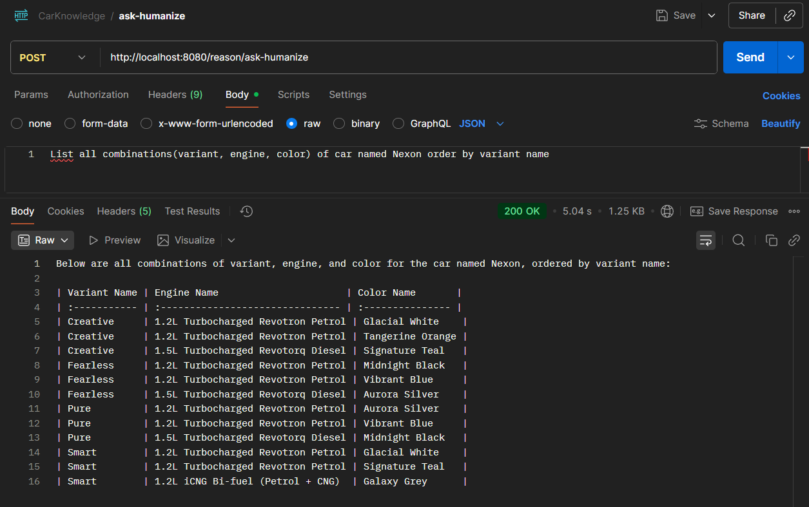

## 🚗 Car Knowledge Graph (MySQL → Semantic KG)
A Java Spring Boot application that transforms relational data from MySQL into a Semantic Knowledge Graph (RDF) using Apache Jena, enriched with vector embeddings for intelligent natural language semantic search.

### ✨ Overview

This project bridges the gap between structured relational databases and semantic web technologies.
It converts MySQL-based automotive data (brands, models, variants, specifications) into a knowledge graph, enabling:

 - Semantic reasoning and SPARQL-based querying.
 - Vector-based semantic similarity search for natural language queries.
 - Integration of symbolic (RDF) and neural (embeddings) representations.

### 🧠 Key Features

- 🔄 Automated Mapping: Translates relational schemas into RDF triples.
- 🧩 Ontology-Driven: Uses custom or standard ontologies to describe domain semantics.
- 🗣️ Natural Language Queries: Query the graph via semantic embeddings and similarity search.
- ⚙️ Spring Boot Integration: RESTful endpoints for knowledge graph and vector search operations.
- 💾 Hybrid Storage: MySQL for structured data, Jena TDB for semantic triples, and embedding store for vector retrieval.



### Glimpses
#### ✍️ NL to SparQL
✨ gemini-2.0-flash-lite

```
curl --location 'http://localhost:8080/reason/generate-sparql' \
--header 'Content-Type: application/json' \
--data 'List all cars variants blue color and petrol fuel type'
```

### 🔍 Semantic Search
✨ gemini-embedding-001

```
curl --location 'http://localhost:8080/car/semantic-search?query=cars%20from%20brands%20from%20Japan'
```

### 🙋 Question Answer
✨ gemini-2.5-flash-lite

```
curl --location 'http://localhost:8080/reason/ask-humanize' \
--header 'Content-Type: application/json' \
--data 'List all combinations(variant, engine, color) of car named Nexon order by variant name'
```